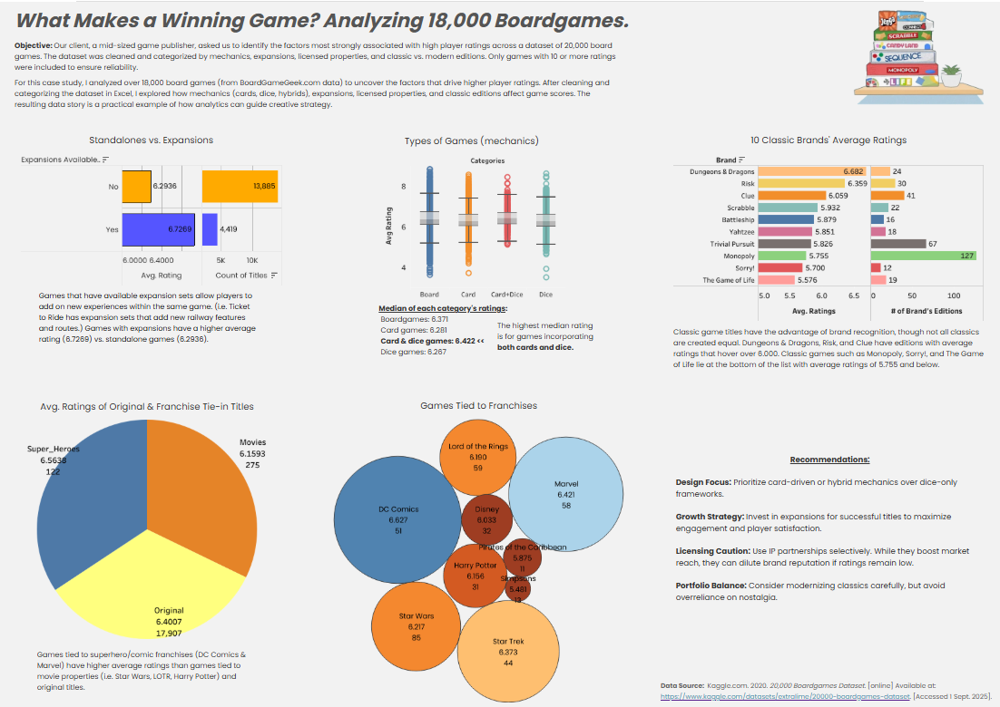

# Board Game Ratings Analysis: What Makes a Winning Game?

Download Executive Summary

## Project Overview
This project analyzes a dataset of 18,304 board games from Kaggle to identify factors driving high player ratings, providing data-driven insights for a mid-sized game publisher. Using Excel for data cleaning and Tableau Public (version 2024.3) for visualization, I created an interactive dashboard to explore trends in game mechanics, expansions, licensed properties, and classic vs. modern editions. A Bayesian weighted rating formula ensured reliable rankings for games with fewer votes. The dashboard, titled "What Makes a Winning Game? Analyzing 18,000 Boardgames," is published at Tableau Public.

## Data Sourcing
The dataset, sourced from Kaggle’s “20,000 Boardgames Dataset” (derived from BoardGameGeek.com), includes 18,304 games with ≥10 user ratings. 

Key fields include:
Game name
Category (board, card, dice, hybrid)
Year published
Min/max players
Average rating
Number of ratings
Game type (standalone, expansion)
Licensed Property/franchise (e.g., Star Wars, Marvel)

Data was downloaded from Kaggle and cleaned in Excel to remove duplicates and incomplete entries, ensuring reliability.

## Data Cleaning in Excel
I cleaned the dataset in Excel by:

Removing duplicates and entries with <10 ratings.
Categorizing games by mechanics (board, card, dice, hybrid) and type (standalone, expansion, licensed, classic).
Applying a Bayesian weighted rating formula for games with 10–99 ratings to adjust for low vote counts: 
[ \text{Weighted Score} = \frac{v}{v+m} \cdot R + \frac{m}{v+m} \cdot C ]

( R ): Average rating of the game

( v ): Number of votes for the game

( m ): Minimum votes for “full trust” (set to 100)

( C ): Overall average rating across all games This formula pulls low-vote games toward the global average, preventing “two-vote wonders” from skewing rankings.

The cleaned dataset was exported as boardgames_cleaned.xlsx.

## Exploratory Data Analysis
In Excel, I conducted exploratory analysis:

Calculated descriptive statistics (mean, median, range) for ratings by category.
Identified correlations between ratings, votes, and game types.
Compared standalone vs. expansion games and licensed vs. original titles.
Grouped classic games (e.g., Monopoly, Risk) and franchise tie-ins (e.g., Marvel, Star Wars) for comparison.

## Dashboard Development in Tableau Public
Using Tableau Public, I built a dashboard, [https://tinyurl.com/2m98vxaf], (1280 x 1024 pixels) titled “What Makes a Winning Game? Analyzing 18,000 Boardgames.” 

The dashboard features five interactive charts:

Bullet Graph: Standalones vs. Expansions (400 x 300 pixels): Shows standalone games generally outperform expansions in average ratings.

Box and Whisker Chart: Types of Games (Mechanics) (400 x 300 pixels): Displays median ratings:
Board games: 6.371; Card games: 6.281; Card & dice games: 6.422 (highest);Dice games: 6.267

Horizontal Bar Chart: 10 Classic Brands’ Average Ratings (400 x 300 pixels): Compares classics:
Top: Dungeons & Dragons, Risk, Clue (~6.0+)
Bottom: Monopoly, Sorry!, The Game of Life (≤5.755)

Pie Chart: Avg. Ratings of Originals & Franchise Tie-Ins (300 x 300 pixels): Shows:
Superhero/comic franchises (DC Comics, Marvel): 6.5638 (122 titles)
Movie properties (Star Wars, LOTR, Harry Potter): 6.1593 (275 titles)
Original titles: 6.4007 (17,907 titles)

Packed Bubbles Chart: Games Tied to Franchises (400 x 300 pixels): Visualizes franchise ratings (color/size by average rating):
DC Comics: 6.627 (51 titles, dark blue, largest)
Marvel: 6.421 (58 titles, light blue, large)
Star Trek: 6.373 (44 titles, light orange, medium)
Star Wars: 6.217 (85 titles, medium orange)
Lord of the Rings: 6.190 (59 titles, medium orange)
Harry Potter: 6.156 (31 titles, dark orange, small)
Simpsons: 5.481 (13 titles, dark brownish-orange, very small)

## Key Insights
Mechanics: Card & dice hybrids (median rating 6.422) outperform pure dice games (6.267).

Expansions: Tend to have slightly lower ratings than standalone games.

Franchises: Superhero franchises (e.g., DC Comics, 6.627) outperform movie tie-ins (e.g., Star Wars, 6.217) but not original titles (6.4007).

Classics: Brand recognition helps (e.g., Dungeons & Dragons), but some classics (e.g., Monopoly) underperform.

Votes: Higher vote counts stabilize ratings, reducing volatility.

## Recommendations
For game publishers:

Design Focus: Prioritize card-driven or hybrid mechanics for higher ratings.

Growth Strategy: Develop expansions for successful titles to boost engagement, but ensure quality.

Licensing Caution: Use superhero franchises selectively; movie tie-ins may underperform.

Portfolio Balance: Modernize classics carefully, focusing on gameplay over nostalgia.

Playtesting: Encourage early reviews to predict long-term success.

## Skills Demonstrated
Data cleaning and transformation (Excel)

Descriptive & inferential analysis (R/statistical reasoning)

Data visualization (Tableau Public)

Storytelling with data

Dashboard UX design for portfolio presentation

